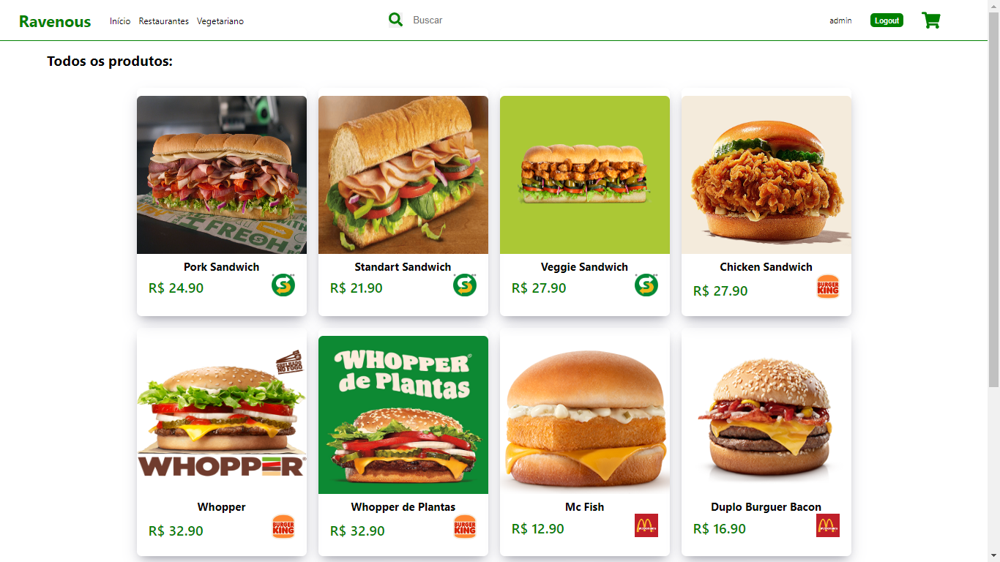

# Ravenous Food
Projeto inspirado no Ifood, onde desenvolvi uma API utilizando o Node.js, Mysql/Sequelize para lidar com o banco e React.js para fazer o front-end

### Tecnologias
- React
- Node
- Mysql
  
### Screenshoots

                        

### desenvolvido por Rafael Debussi
